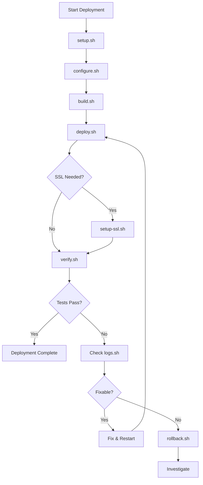
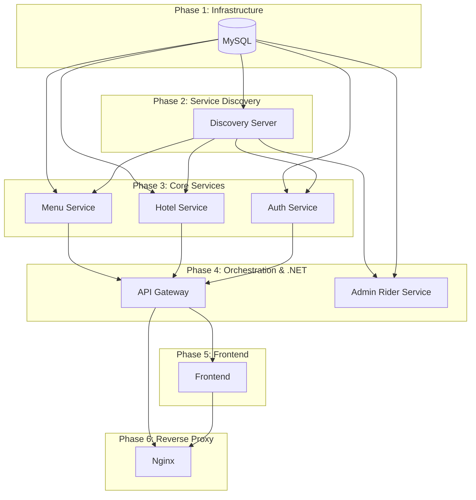

# Food Delivery Application - Execution Flow

This document explains the execution flow of deployment scripts and the sequence of operations during application startup.

---

## Table of Contents

- [Deployment Script Execution Flow](#deployment-script-execution-flow)
- [Service Startup Sequence](#service-startup-sequence)
- [Request Flow](#request-flow)
- [Health Check Flow](#health-check-flow)
- [SSL Certificate Flow](#ssl-certificate-flow)
- [Rollback Flow](#rollback-flow)

---

## Deployment Script Execution Flow

### Complete Deployment Pipeline



### Script Dependencies

```
┌─────────────────────────────────────────────────────────────────────┐
│                          DEPLOYMENT FLOW                             │
├─────────────────────────────────────────────────────────────────────┤
│                                                                       │
│   ┌──────────┐                                                       │
│   │ setup.sh │ ◀── Run ONCE per server                              │
│   └────┬─────┘                                                       │
│        │                                                              │
│        │  Prerequisites: None (installs Docker, configures OS)      │
│        ▼                                                              │
│   ┌──────────────┐                                                   │
│   │ configure.sh │ ◀── Run ONCE (or when config changes)            │
│   └────┬─────────┘                                                   │
│        │                                                              │
│        │  Prerequisites: Docker installed, .env.example exists      │
│        ▼                                                              │
│   ┌──────────┐                                                       │
│   │ build.sh │ ◀── Run when code changes                            │
│   └────┬─────┘                                                       │
│        │                                                              │
│        │  Prerequisites: Docker running, .env configured             │
│        ▼                                                              │
│   ┌───────────┐                                                      │
│   │ deploy.sh │ ◀── Run to deploy/redeploy                          │
│   └────┬──────┘                                                      │
│        │                                                              │
│        │  Prerequisites: Images built, Nginx config ready           │
│        ▼                                                              │
│   ┌──────────────┐                                                   │
│   │ setup-ssl.sh │ ◀── Run ONCE after deployment (optional)        │
│   └────┬─────────┘                                                   │
│        │                                                              │
│        │  Prerequisites: Services running, DNS configured           │
│        ▼                                                              │
│   ┌───────────┐                                                      │
│   │ verify.sh │ ◀── Run after any deployment                        │
│   └───────────┘                                                      │
│                                                                       │
└─────────────────────────────────────────────────────────────────────┘
```

---

## Script Execution Details

### 1. setup.sh (System Preparation)

```
┌─────────────────────────────────────────────────────────────────────┐
│                          setup.sh Flow                               │
├─────────────────────────────────────────────────────────────────────┤
│                                                                       │
│   START                                                               │
│     │                                                                 │
│     ▼                                                                 │
│   ┌──────────────┐                                                   │
│   │ Check if root│───△ Not root? Exit with error                    │
│   └──────┬───────┘                                                   │
│          │                                                            │
│          ▼                                                            │
│   ┌──────────────┐                                                   │
│   │ Detect OS    │ Ubuntu/Debian/CentOS/RHEL                        │
│   └──────┬───────┘                                                   │
│          │                                                            │
│          ▼                                                            │
│   ┌──────────────┐                                                   │
│   │Check Resources│                                                  │
│   │ - RAM >= 4GB │───△ Insufficient? Exit                           │
│   │ - Disk >= 15GB│                                                  │
│   │ - CPU cores  │                                                   │
│   └──────┬───────┘                                                   │
│          │                                                            │
│          ▼                                                            │
│   ┌──────────────┐                                                   │
│   │Update Packages│ apt update/dnf update                           │
│   └──────┬───────┘                                                   │
│          │                                                            │
│          ▼                                                            │
│   ┌──────────────┐                                                   │
│   │Install Prereqs│ curl, wget, git, bc, etc.                       │
│   └──────┬───────┘                                                   │
│          │                                                            │
│          ▼                                                            │
│   ┌──────────────┐                                                   │
│   │ Setup Swap   │ If RAM < 8GB, create 4GB swap                    │
│   └──────┬───────┘                                                   │
│          │                                                            │
│          ▼                                                            │
│   ┌──────────────┐                                                   │
│   │Install Docker│ via get.docker.com                               │
│   └──────┬───────┘                                                   │
│          │                                                            │
│          ▼                                                            │
│   ┌──────────────┐                                                   │
│   │Configure UFW │ Allow 22, 80, 443                                │
│   └──────┬───────┘                                                   │
│          │                                                            │
│          ▼                                                            │
│   ┌──────────────┐                                                   │
│   │ Test Docker  │ docker run hello-world                           │
│   └──────┬───────┘                                                   │
│          │                                                            │
│          ▼                                                            │
│       COMPLETE                                                        │
│                                                                       │
└─────────────────────────────────────────────────────────────────────┘
```

### 2. configure.sh (Environment Setup)

```
┌─────────────────────────────────────────────────────────────────────┐
│                        configure.sh Flow                             │
├─────────────────────────────────────────────────────────────────────┤
│                                                                       │
│   START                                                               │
│     │                                                                 │
│     ▼                                                                 │
│   ┌────────────────┐                                                 │
│   │Check Docker    │───△ Not running? Exit                          │
│   └──────┬─────────┘                                                 │
│          │                                                            │
│          ▼                                                            │
│   ┌────────────────┐        ┌─────────────────────┐                 │
│   │.env exists?    │───Yes──│Backup & use existing│                 │
│   └──────┬─────────┘        └─────────────────────┘                 │
│          │No                                                         │
│          ▼                                                            │
│   ┌────────────────┐                                                 │
│   │Copy .env.example│                                                │
│   └──────┬─────────┘                                                 │
│          │                                                            │
│          ▼                                                            │
│   ┌────────────────┐     ┌──────────────────────┐                   │
│   │Interactive Mode│─Yes─│ Prompt for:          │                   │
│   │   (-i flag)?   │     │ - Domain             │                   │
│   └──────┬─────────┘     │ - SSL Email          │                   │
│          │No             │ - Generate passwords │                   │
│          │               └──────────────────────┘                   │
│          ▼                                                            │
│   ┌────────────────┐                                                 │
│   │Generate Secrets│ If using defaults                              │
│   └──────┬─────────┘                                                 │
│          │                                                            │
│          ▼                                                            │
│   ┌────────────────┐                                                 │
│   │ Validate DNS   │ Check domain → server IP                       │
│   └──────┬─────────┘                                                 │
│          │                                                            │
│          ▼                                                            │
│   ┌────────────────┐     ┌──────────────────────┐                   │
│   │SSL certs exist?│─Yes─│Use nginx.prod.conf   │                   │
│   └──────┬─────────┘     └──────────────────────┘                   │
│          │No                                                         │
│          ▼                                                            │
│   ┌────────────────┐                                                 │
│   │Use nginx.initial│ HTTP only (pre-SSL)                           │
│   └──────┬─────────┘                                                 │
│          │                                                            │
│          ▼                                                            │
│       COMPLETE                                                        │
│                                                                       │
└─────────────────────────────────────────────────────────────────────┘
```

### 3. deploy.sh (Service Deployment)

```
┌─────────────────────────────────────────────────────────────────────┐
│                          deploy.sh Flow                              │
├─────────────────────────────────────────────────────────────────────┤
│                                                                       │
│   START                                                               │
│     │                                                                 │
│     ▼                                                                 │
│   ┌────────────────┐                                                 │
│   │ Pre-flight     │                                                 │
│   │ - Docker OK?   │───△ Fail? Exit                                 │
│   │ - .env exists? │                                                 │
│   │ - Disk space?  │                                                 │
│   └──────┬─────────┘                                                 │
│          │                                                            │
│          ▼                                                            │
│   ┌────────────────┐                                                 │
│   │Setup Nginx conf│ Copy initial or prod config                    │
│   └──────┬─────────┘                                                 │
│          │                                                            │
│          ▼                                                            │
│   ┌────────────────┐     ┌──────────────────────┐                   │
│   │--no-build flag?│─Yes─│  Skip build step     │                   │
│   └──────┬─────────┘     └──────────────────────┘                   │
│          │No                                                         │
│          ▼                                                            │
│   ┌────────────────┐                                                 │
│   │Build all images│ docker compose build                           │
│   └──────┬─────────┘                                                 │
│          │                                                            │
│          ▼                                                            │
│   ┌────────────────┐                                                 │
│   │Stop existing   │ docker compose down                            │
│   └──────┬─────────┘                                                 │
│          │                                                            │
│          ▼                                                            │
│   ┌────────────────┐                                                 │
│   │Start containers│ docker compose up -d                           │
│   └──────┬─────────┘                                                 │
│          │                                                            │
│          ▼                                                            │
│   ┌────────────────┐                                                 │
│   │Wait for health │ Loop until healthy or timeout                  │
│   │checks to pass  │ (up to 5 minutes)                              │
│   └──────┬─────────┘                                                 │
│          │                                                            │
│          ▼                                                            │
│   ┌────────────────┐                                                 │
│   │ Show status    │ docker compose ps                              │
│   └──────┬─────────┘                                                 │
│          │                                                            │
│          ▼                                                            │
│       COMPLETE                                                        │
│                                                                       │
└─────────────────────────────────────────────────────────────────────┘
```

---

## Service Startup Sequence

When Docker Compose starts services, they boot in dependency order:



### Health Check Dependencies

| Service | Depends On | Health Check |
|---------|------------|--------------|
| MySQL | - | `mysqladmin ping` |
| Discovery Server | - | `/actuator/health` |
| API Gateway | Discovery Server | `/actuator/health` |
| Auth Service | MySQL, Discovery | `/actuator/health` |
| Hotel Service | MySQL, Discovery | `/actuator/health` |
| Menu Service | MySQL, Discovery | `/actuator/health` |
| Admin Rider Service | MySQL, Discovery | `/health` |
| Frontend | - | `curl /health` |
| Nginx | Frontend, Gateway | `curl /health` |

---

## Request Flow

### External Request (User → Application)

```
┌─────────────────────────────────────────────────────────────────────┐
│                          REQUEST FLOW                                │
├─────────────────────────────────────────────────────────────────────┤
│                                                                       │
│   [User Browser]                                                      │
│        │                                                              │
│        │ HTTPS request to fooddelivery.ghagevaibhav.xyz              │
│        ▼                                                              │
│   ┌─────────────────┐                                                │
│   │    Internet     │                                                │
│   └────────┬────────┘                                                │
│            │                                                          │
│            │ Port 443 (HTTPS)                                        │
│            ▼                                                          │
│   ╔═══════════════════════════════════════════════════════════════╗ │
│   ║                      NGINX (Reverse Proxy)                     ║ │
│   ║  ┌─────────────────────────────────────────────────────────┐  ║ │
│   ║  │ • SSL Termination (TLS 1.2/1.3)                         │  ║ │
│   ║  │ • Security Headers (HSTS, X-Frame-Options, etc.)        │  ║ │
│   ║  │ • Rate Limiting                                         │  ║ │
│   ║  │ • Request Routing                                       │  ║ │
│   ║  └─────────────────────────────────────────────────────────┘  ║ │
│   ╚════════════════════════════╤══════════════════════════════════╝ │
│                                │                                     │
│         ┌──────────────────────┼──────────────────────┐              │
│         │                      │                      │              │
│         ▼                      ▼                      ▼              │
│    Path: /*              Path: /api/*           Path: /.well-known/  │
│         │                      │                      │              │
│         ▼                      ▼                      ▼              │
│   ┌─────────────┐      ┌─────────────────┐    ┌───────────┐         │
│   │  Frontend   │      │   API Gateway   │    │  Certbot  │         │
│   │  (React)    │      │ (Spring Cloud)  │    │  (ACME)   │         │
│   └─────────────┘      └────────┬────────┘    └───────────┘         │
│                                 │                                    │
│     ┌───────────────────────────┼───────────────────────────┐        │
│     │                           │                           │        │
│     ▼                           ▼                           ▼        │
│ /api/auth/*              /api/hotels/*              /api/admin/*     │
│     │                    /api/orders/*              /api/rider/*     │
│     ▼                           │                           │        │
│ ┌───────────┐            ┌──────┴──────┐            ┌───────▼──────┐│
│ │   Auth    │            │    Hotel    │            │  Admin Rider ││
│ │  Service  │            │   Service   │            │   Service    ││
│ └─────┬─────┘            └──────┬──────┘            └───────┬──────┘│
│       │                         │                           │       │
│       │              ┌──────────┴──────────┐               │        │
│       │              │                     │               │        │
│       ▼              ▼                     ▼               ▼        │
│   ╔═══════════════════════════════════════════════════════════════╗ │
│   ║                        MySQL Database                          ║ │
│   ║  ┌─────────────┐ ┌─────────────┐ ┌─────────────┐ ┌──────────┐ ║ │
│   ║  │ auth_db     │ │ hotel_db    │ │ menu_db     │ │ admin_db │ ║ │
│   ║  └─────────────┘ └─────────────┘ └─────────────┘ └──────────┘ ║ │
│   ╚═══════════════════════════════════════════════════════════════╝ │
│                                                                       │
└─────────────────────────────────────────────────────────────────────┘
```

### API Request Example: Get Hotels

```
1. User: GET https://fooddelivery.ghagevaibhav.xyz/api/hotels

2. Nginx:
   - Receives request on :443
   - Terminates SSL
   - Adds security headers
   - Routes to api-gateway:8080

3. API Gateway:
   - Receives: GET /api/hotels
   - Looks up "HOTEL-SERVICE" in Eureka
   - Gets instance: hotel-service:9082
   - Forwards request

4. Hotel Service:
   - Receives: GET /api/hotels
   - Queries MySQL (fooddelivery_hotel)
   - Returns JSON response

5. Response flows back through:
   Hotel Service → API Gateway → Nginx → User
```

---

## Health Check Flow

### Startup Health Verification

```
┌─────────────────────────────────────────────────────────────────────┐
│                      HEALTH CHECK FLOW                               │
├─────────────────────────────────────────────────────────────────────┤
│                                                                       │
│   Deploy Script starts containers                                    │
│        │                                                              │
│        ▼                                                              │
│   ┌────────────────────────────────────────────────────────┐         │
│   │                   WAIT LOOP                             │         │
│   │                                                         │         │
│   │   Every 10 seconds for up to 5 minutes:                │         │
│   │                                                         │         │
│   │   for each service:                                     │         │
│   │       status = docker inspect --format Health.Status    │         │
│   │       if status != "healthy":                           │         │
│   │           continue waiting                              │         │
│   │                                                         │         │
│   │   if all healthy:                                       │         │
│   │       break loop → SUCCESS                              │         │
│   │                                                         │         │
│   │   if timeout:                                           │         │
│   │       show warnings → PARTIAL SUCCESS                   │         │
│   │                                                         │         │
│   └────────────────────────────────────────────────────────┘         │
│                                                                       │
└─────────────────────────────────────────────────────────────────────┘
```

### Docker Health Check Configuration

Each container has a health check defined:

```yaml
# Java services (Spring Boot)
healthcheck:
  test: ["CMD", "wget", "-q", "--spider", "http://localhost:PORT/actuator/health"]
  interval: 30s
  timeout: 10s
  retries: 5
  start_period: 120s   # Wait for JVM to start

# .NET service
healthcheck:
  test: ["CMD", "curl", "-f", "http://localhost:9086/health"]
  interval: 30s
  timeout: 10s
  retries: 5
  start_period: 60s

# MySQL
healthcheck:
  test: ["CMD", "mysqladmin", "ping", "-h", "localhost"]
  interval: 10s
  timeout: 5s
  retries: 10
  start_period: 30s
```

---

## SSL Certificate Flow

### Initial Certificate Generation

```
┌─────────────────────────────────────────────────────────────────────┐
│                      SSL SETUP FLOW                                  │
├─────────────────────────────────────────────────────────────────────┤
│                                                                       │
│   ./deploy/setup-ssl.sh --production                                 │
│        │                                                              │
│        ▼                                                              │
│   ┌──────────────┐                                                   │
│   │ Check prereqs│                                                   │
│   │ - Nginx up   │───△ Fail? Exit                                   │
│   │ - DNS OK     │                                                   │
│   └──────┬───────┘                                                   │
│          │                                                            │
│          ▼                                                            │
│   ┌──────────────┐                                                   │
│   │Run Certbot   │                                                   │
│   │via Docker    │                                                   │
│   └──────┬───────┘                                                   │
│          │                                                            │
│          ▼                                                            │
│   ╔══════════════════════════════════════════════════════════════╗  │
│   ║                    ACME Protocol                              ║  │
│   ║                                                               ║  │
│   ║  1. Certbot → Let's Encrypt: "I want cert for domain.com"   ║  │
│   ║                                                               ║  │
│   ║  2. Let's Encrypt → Certbot: "Prove you own it.             ║  │
│   ║                               Put token at:                   ║  │
│   ║                               /.well-known/acme-challenge/X" ║  │
│   ║                                                               ║  │
│   ║  3. Certbot: writes token to /var/www/certbot/...           ║  │
│   ║                                                               ║  │
│   ║  4. Let's Encrypt: HTTP request to domain.com/.well-known/  ║  │
│   ║                    → Nginx serves from certbot volume        ║  │
│   ║                                                               ║  │
│   ║  5. Let's Encrypt: "Verified! Here's your certificate"      ║  │
│   ║                                                               ║  │
│   ╚══════════════════════════════════════════════════════════════╝  │
│          │                                                            │
│          ▼                                                            │
│   ┌──────────────┐                                                   │
│   │Certs saved to│ /etc/letsencrypt/live/domain.com/               │
│   │Docker volume │ - fullchain.pem                                  │
│   └──────┬───────┘ - privkey.pem                                    │
│          │                                                            │
│          ▼                                                            │
│   ┌──────────────┐                                                   │
│   │Generate Nginx│ envsubst nginx.prod.conf.template                │
│   │SSL config    │ → nginx/nginx.conf                               │
│   └──────┬───────┘                                                   │
│          │                                                            │
│          ▼                                                            │
│   ┌──────────────┐                                                   │
│   │Reload Nginx  │ docker exec nginx nginx -s reload                │
│   └──────┬───────┘                                                   │
│          │                                                            │
│          ▼                                                            │
│   ┌──────────────┐                                                   │
│   │Setup cron    │ Auto-renewal every 12 hours                      │
│   └──────┬───────┘                                                   │
│          │                                                            │
│          ▼                                                            │
│       COMPLETE ─── HTTPS now working!                                │
│                                                                       │
└─────────────────────────────────────────────────────────────────────┘
```

### Auto-Renewal Flow

```
┌─────────────────────────────────────────────────────────────────────┐
│                    AUTO-RENEWAL (Cron Job)                           │
├─────────────────────────────────────────────────────────────────────┤
│                                                                       │
│   Every 12 hours:                                                    │
│        │                                                              │
│        ▼                                                              │
│   ┌──────────────────────────────────────────────────────┐           │
│   │ docker compose run --rm certbot renew                │           │
│   └──────────────────────────────────────────────────────┘           │
│        │                                                              │
│        ▼                                                              │
│   ┌──────────────┐        ┌─────────────────────────────┐           │
│   │ Cert expiring│──Yes──▶│ Renew & reload Nginx        │           │
│   │ in < 30 days?│        └─────────────────────────────┘           │
│   └──────┬───────┘                                                   │
│          │No                                                         │
│          ▼                                                            │
│   [ Do nothing - cert is still valid ]                               │
│                                                                       │
└─────────────────────────────────────────────────────────────────────┘
```

---

## Rollback Flow

### Quick Rollback

```
┌─────────────────────────────────────────────────────────────────────┐
│                      QUICK ROLLBACK                                  │
├─────────────────────────────────────────────────────────────────────┤
│                                                                       │
│   ./deploy/rollback.sh --quick                                       │
│        │                                                              │
│        ▼                                                              │
│   ┌───────────────────────┐                                          │
│   │ docker compose down   │ Stop all containers                      │
│   └───────────┬───────────┘                                          │
│               │                                                       │
│               ▼                                                       │
│   ┌───────────────────────┐                                          │
│   │ docker compose up -d  │ Restart with existing images             │
│   └───────────┬───────────┘ (no rebuild)                             │
│               │                                                       │
│               ▼                                                       │
│   ┌───────────────────────┐                                          │
│   │ Wait for health checks│                                          │
│   └───────────┬───────────┘                                          │
│               │                                                       │
│               ▼                                                       │
│          COMPLETE                                                     │
│                                                                       │
└─────────────────────────────────────────────────────────────────────┘
```

### Full State Restoration

```
┌─────────────────────────────────────────────────────────────────────┐
│                    FULL STATE RESTORATION                            │
├─────────────────────────────────────────────────────────────────────┤
│                                                                       │
│   BEFORE DEPLOYMENT:                                                 │
│   ./deploy/rollback.sh --save                                        │
│        │                                                              │
│        ▼                                                              │
│   ┌───────────────────────────────────────────────────────┐          │
│   │ Saves to .rollback-state:                             │          │
│   │  - Current image IDs                                  │          │
│   │  - Backup of .env                                     │          │
│   │  - Backup of nginx.conf                               │          │
│   └───────────────────────────────────────────────────────┘          │
│                                                                       │
│   AFTER FAILED DEPLOYMENT:                                           │
│   ./deploy/rollback.sh --restore                                     │
│        │                                                              │
│        ▼                                                              │
│   ┌───────────────────────────────────────────────────────┐          │
│   │ 1. Read .rollback-state                               │          │
│   │ 2. Restore .env from backup                           │          │
│   │ 3. Restore nginx.conf from backup                     │          │
│   │ 4. Restart containers                                 │          │
│   └───────────────────────────────────────────────────────┘          │
│                                                                       │
└─────────────────────────────────────────────────────────────────────┘
```

---

**Last Updated:** February 2026
